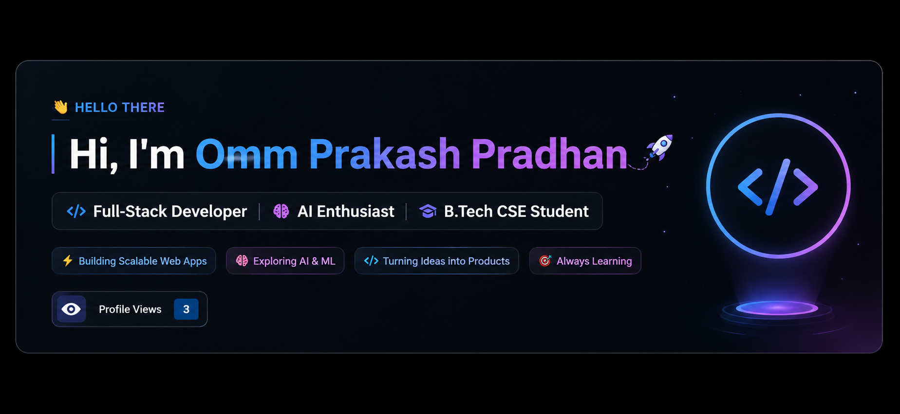

<p align="center">
  
</p>

<h1 align="center">
  Hi, I'm Omm Prakash Pradhan 👋
</h1>

<p align="center">
  <strong>Full-Stack Developer • AI Enthusiast • B.Tech CSE Student</strong>
</p>

<p align="center">
  Building AI-powered applications • Full-Stack Web Development • Continuous Learning
</p>

---


<p align="center">
  
</p>

<p align="center">
  <a href="https://github.com/ommprakashpradhan77">
    
  </a>
</p>

---

## 🚀 About Me

I'm a **B.Tech Computer Science Engineering student** passionate about
building **AI-powered applications, modern web platforms, and practical
software solutions**.

I enjoy working across the stack — from designing responsive interfaces
to developing backend APIs and integrating intelligent AI capabilities.

### ⚡ What I'm Focused On

| 💻 Development | 🤖 Artificial Intelligence |
|---|---|
| Full-Stack Web Applications | Generative AI |
| Backend Development | Machine Learning |
| REST APIs & Databases | AI-powered Applications |
| Cloud & Deployment | Intelligent Automation |

### 🎯 Currently

- 🔭 Building **AI-powered & full-stack applications**
- 🧠 Exploring **Generative AI, Machine Learning & LLM applications**
- ⚙️ Strengthening **Backend Development, Cloud Computing & System Design**
- 📚 Continuously learning by building **real-world projects**
- 🎯 Working toward becoming a **strong AI & Software Engineer**
- 📍 **Odisha, India**

---

## 🛠️ Tech Stack

### 💻 Languages

<p>
  
</p>

### 🌐 Frontend

<p>
  
</p>

### ⚙️ Backend

<p>
  
</p>

### 🗄️ Databases

<p>
  
</p>

### 🤖 AI / Machine Learning

<p>
  
</p>

### 🔧 Tools & Platforms

<p>
  
</p>

---

## 💡 My Development Philosophy

> **Learn continuously. Build practically. Solve real problems.**

I believe the best way to grow as a developer is to **learn by building,
experiment with new technologies, and turn ideas into useful products.**

---


## 🚀 Featured Projects

### 🤖 AI Tender Evaluation System
AI-powered system designed to analyze and evaluate tender documents using intelligent
document processing and automated analysis.

**Tech:** Python • AI/ML • NLP • FastAPI

---

### 📚 AI Study Buddy
An AI-powered learning assistant designed to help students create study plans,
ask questions, summarize documents and learn more efficiently.

**Tech:** Python • FastAPI • RAG • LLM • Flutter

---

### 🌐 Full-Stack Portfolio
A personal developer portfolio showcasing my projects, skills, experience and
technical journey.

**Tech:** React • Node.js • MongoDB

---

### 🍎 Smart Food Analyzer
A web-based application focused on food analysis with features such as
fruit ripeness detection, expiry estimation, nutrition information and
camera-based analysis.

**Tech:** HTML • CSS • JavaScript • AI/ML

---

## 📊 GitHub Statistics

<p align="center">
  
  
</p>

---

## 🔥 GitHub Streak

<p align="center">
  
</p>

---

## 🏆 Achievements & Experience

- 💼 **FlyRank Internship** — Worked on real-world development and AI-related tasks
- 🤖 Completed **AI / Generative AI learning programs**
- 🧑‍💻 Building and deploying full-stack applications
- 📚 Continuously learning modern software engineering technologies
- 🚀 Participating in technical projects, assignments and development challenges

---

## 🎯 Current Focus

```text
Full-Stack Development
        ↓
Backend Engineering
        ↓
Generative AI
        ↓
Machine Learning
        ↓
AI-Powered Applications
        ↓
Scalable Software Systems
